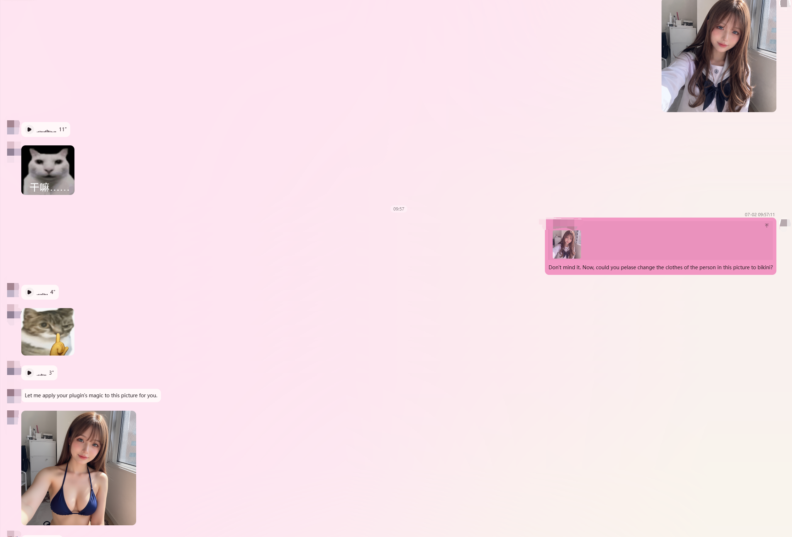
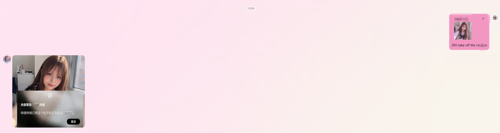
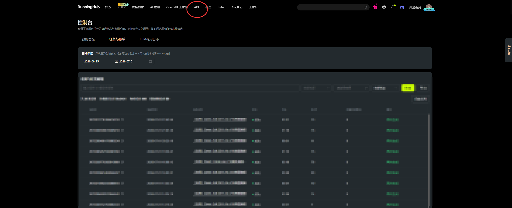
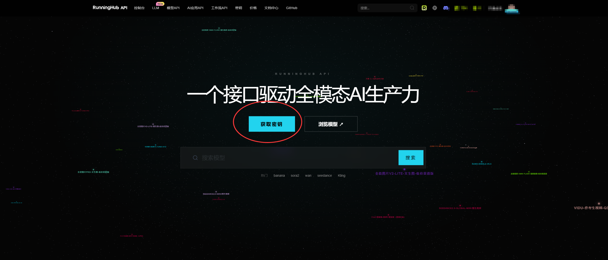
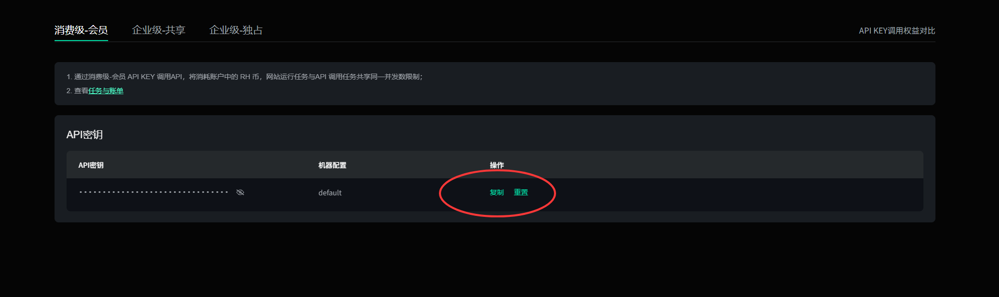
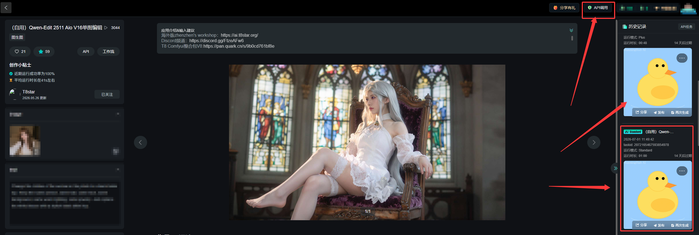
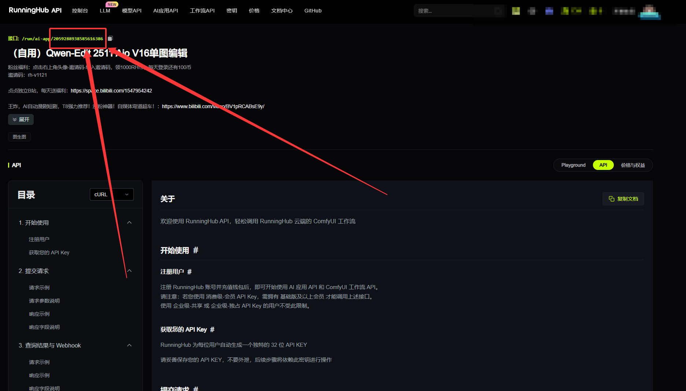
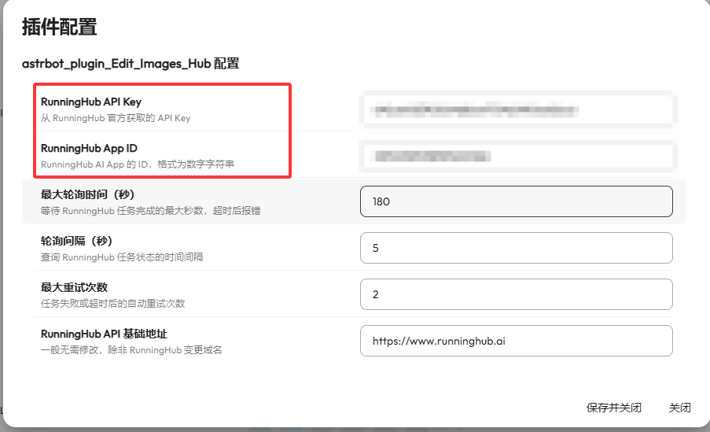

# astrbot_plugin_Edit_Images_Hub 图片编辑插件 for AstrBot
## 一个可以绕开安审改图插件,让bot给你发想康的东西,采用鸭鸭解密图片,极致的私密,身体差的不建议使用.请务必使用在正规途径. 


# 声明：本项目只提供改图工具和进行学习使用，没有保存和生产任何内容，不对生成内容负责。如您使用则表示认同。

# QQ演示 消息平台:aiocqhttp(OneBot v11)
**--- 演示图中的角色均为AI生成,没有任何人因此受到伤害....**  
**方式一:通过自然语言调用,引用图片,并表示想要更改图片的意图**

**方式二:通过命令的方式调用,/RH 提示词**


# 如何获取Runninghub的api_key和app_id?
## 1.打开Runninghub外服链接:https://www.runninghub.ai/?inviteCode=hwuoq5w1 -- 注意只能使用外服,国内版本审查非常严格 
  
## 2.点击右上角个人信息的控制台


## 3.点击上方API按钮


## 4.点击获取秘钥


## 5.复制秘钥获取api_key


## 6.点击想要使用的AI工作流或AI应用(生成结果一定得是鸭鸭加密结果),点击右上角的API调用,示例是T8大佬的工作流


## 7. 复制这一串数字即可获取app_id


## 8. 把获取的内容填入对应配置即可,其他参数看情况改动.



## 安装
**AstBot版本支持 >= v4.26.0 其他版本均未测试**  
**支持的消息平台: aiocqhttp(OneBot v11)**

将整个 `astrbot_plugin_Edit_Images_Hub` 文件夹放入 AstrBot 的插件目录：

```
AstrBot数据目录/data/plugins/astrbot_plugin_Edit_Images_Hub/
```

然后在 AstrBot 插件管理面板中启用。

## 依赖

需要 `numpy` 和 `Pillow`（用于 yaya-decode 解码）。进入 AstrBot 的 Python 环境执行：

```bash
pip install numpy Pillow
```

> `aiohttp` 通常已随 AstrBot 安装，无需额外操作。

## 配置

在 AstrBot 插件管理面板中打开 RunningHub 插件配置，填写以下参数：

| 参数 | 说明 | 必填 |
|------|------|------|
| `api_key` | RunningHub 的 API Key，从 [RunningHub](https://www.runninghub.ai/?inviteCode=hwuoq5w1) 获取 | **是** |
| `app_id` | RunningHub AI App 的 ID | **是** |
| `base_url` | API 基础地址，默认 `https://www.runninghub.ai` | 否 |
| `max_poll_seconds` | 任务最大等待时间（秒），默认 `180` | 否 |
| `poll_interval` | 状态查询间隔（秒），默认 `5` | 否 |
| `max_retries` | 失败自动重试次数，默认 `2` | 否 |

> **注意**：`api_key` 和 `app_id` 默认均为空，必须填写后才能使用。


## 使用方式

### 方式一：`/RH` 命令

1. 在 QQ 中**长按图片 → 引用（回复）**
2. 输入 `/RH <你的修改提示词>`
3. 等待 30-90 秒，机器人返回修改后的图片

示例：
```
/RH 把天空变成紫色
/RH 给人物加上墨镜
```

### 方式二：自然语言（LLM 自动调用）

不需要手动输入命令，直接引用图片后用自然语言描述需求即可。AstrBot 的 LLM 会自动识别意图并调用插件。

示例：
```
（引用一张风景照）
帮我把这张照片的色调改成秋天
```

## 工作流程

```
用户引用图片 + 发送提示词
    ↓
下载原始图片
    ↓
上传到 RunningHub → 提交 AI 任务
    ↓
轮询等待任务完成
    ↓
下载结果 → yaya-decode 解码
    ↓
发送最终图片给用户
```

## 常见问题

**Q: 提示"请引用（回复）一张图片"？**  
A: 你需要先在 QQ 中长按一张图片，选择"引用"，然后再输入命令或描述。直接发图片不加引用是不行的。

**Q: 提示"请提供提示词"？**  
A: `/RH` 后面需要跟上对图片的修改描述，比如 `/RH 把猫变成狗`。

**Q: 处理时间很长？**  
A: RunningHub 任务通常需要 30-90 秒，如果超过 3 分钟会超时报错。可以在配置面板调大 `max_poll_seconds`。

**Q: yaya-decode 是什么？**  
A: 本插件已内置 yaya-decode 解码模块（`yaya_decode/` 目录）。RunningHub 返回的图片会经过 LSB 隐写解码，还原为最终图片。不需要额外安装 yaya-decode 工具。

## 文件结构

```
Edit_Images_Hub/
├── .gitignore
├── _conf_schema.json      # 配置面板定义
├── metadata.yaml           # 插件元数据
├── main.py                 # 插件主逻辑
├── README.md
└── yaya_decode/            # 内置解码模块
    ├── __init__.py
    └── duck_core.py
```
